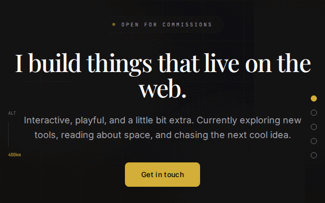

# Personal-Site — Mission Control 🛰️

A 3D holographic personal landing page. Your name glows at the core of a rotating wireframe globe while live **weather**, **world news**, and **tech news** float around it like orbiting satellites.



**Live site:** https://lianbeast.github.io/Personal-Site/

## ✨ Features

- 🌍 Rotating 3D wireframe globe (Three.js / react-three-fiber) — drag to spin
- 🌤 **Weather** — autodetects the visitor's location (Imperial °F/mph), falls back to a configured city (Open-Meteo, free & keyless)
- ⚡ **Tech news** — Hacker News top stories (CORS-enabled API)
- 📰 **World news** — BBC headlines via rss2json (native CORS)
- 📦 **Live GitHub projects** — most recently pushed public repos pulled from the GitHub API
- 🗺 **Map Room** — full browser GIS (GeoLibre) embedded with map-only chrome, pan/zoom + 1,000 geoprocessing tools, everything local
- 👤 Glowing identity core with social links, plus About + Projects sections
- 🎛 Click any card to zoom into "focus mode"
- ⏸ **Pause orbit** — freeze the carousel, then **drag cards anywhere** to rearrange; resume to start orbiting again

## 🚀 Development

```bash
npm install
npm run dev        # local dev server
npm run build      # typecheck + production build
npm run preview    # serve the production build
```

## 🔁 Deploy + live GIF loop

Every push to `main`:

1. **`deploy.yml`** builds and deploys the site to GitHub Pages.
2. **`preview-gif.yml`** records the deployed page (~8s of the 3D animation) with Playwright, stitches it into `preview.gif`, and commits it back — so this README always shows the current look.

One-time repo settings:
- **Settings → Pages → Source: GitHub Actions**

## ✏️ Make it yours

Everything personal lives in [`src/config.ts`](src/config.ts) — name, tagline, city, social links, about text, and projects. Edit, push, done.

To record the GIF locally: `npm run record:preview -- http://localhost:4173/`
