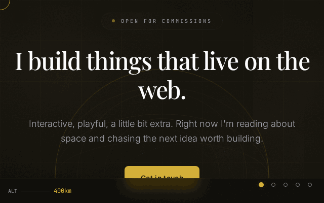

# Personal-Site

A scroll-narrative landing page. Five sticky, full-viewport scenes (hero →
about → capabilities → projects → contact) read like a controlled descent,
tracked by a fixed HUD — altitude readout on the left, scene rail on the
right. Everything renders from CSS and SVG; there is no 3D canvas, no WebGL,
and no network data on the critical path.



**Live site:** https://lianbeast.github.io/Personal-Site/

## Features

- **Scroll narrative.** Five `100dvh` `position: sticky` scenes, each three
  layers: a CSS parallax background, an SVG art motif (planet horizon,
  transmission rings, circuit traces, constellation, landing pad), and a
  centered content column. Kinetic reveal on every element.
- **HUD.** Left depth meter ("ALT" → "ground") fills with scroll progress,
  measured against the narrative's own extent, not the document bottom.
  Right scene rail with five anchor dots; the active one turns gold.
- **Live GitHub projects.** Most recently pushed public repos, pulled from the
  GitHub API. Falls back to a curated static list on failure — the page never
  depends on it rendering.
- **Map Room.** GeoLibre embedded with map-only chrome, pan and zoom, 1,000+
  geoprocessing tools, everything running locally in the browser.
- **Custom cursor.** Gold ring that grows to 80px over interactive elements,
  trailing a six-node ribbon that blooms with pointer speed. Plain CSS
  transforms, no WebGL, no new dependency.
- **Magnetic buttons** with tactile click scaling; capability cards lift a
  gold glow on hover; project cards show a recorded clip of the live site on
  hover.
- **Reduced motion** honoured on every path: art fades in without drifting or
  breathing, the cursor trail renders nothing at all, `ScrollReveal` skips its
  tween entirely.

## Architecture

```
src/
  App.tsx              # Scene composition + HUD + sections
  main.tsx             # Entry
  config.ts            # Single source of truth: name, tagline, links,
                       # about, features, contact, projects, geolibre
  index.css            # @theme tokens + all CSS (backgrounds, art, HUD, cursor)
  components/
    NarrativeScenes.tsx    # 5 sticky 100dvh scenes + SVG art motifs
    NarrativeHUD.tsx       # Depth meter + scene rail
    Background.tsx         # Parallax background variants
    ProjectsSection.tsx    # Live GitHub repos (+ static fallback)
    ProjectPreview.tsx     # Recorded mp4 + poster previews
    MapRoomSection.tsx     # GeoLibre iframe embed
    ScrollReveal.tsx       # gsap ScrollTrigger reveal
    Eyebrow.tsx            # Shared section index label
    SplashCursor.tsx       # Gold cursor ring + velocity trail
    Footer.tsx
  hooks/  useAsync.ts, useInView.ts
  lib/    github.ts     # Typed GitHub API client
```

**Data flow:** the GitHub feed is fetched through `useAsync`, which owns the
loading / error / success state and the refresh path. On failure the projects
section renders the static `site.projects` list instead — a failed API call
never breaks the page.

**Stack:** Vite + React 19 + TypeScript, Tailwind CSS v4 (tokens declared in
an `@theme` block in `index.css`), GSAP + ScrollTrigger for section reveals,
Framer `motion` for scene reveals and `useReducedMotion`.

## Design system

- **Tokens** live in the `@theme` block of `src/index.css` (colors, fonts,
  transitions) plus semantic aliases. A human-readable copy is extracted to
  `opendesign/design-systems/personal-site/tokens/colors_and_type.css`.
- **Cards** share one treatment: 16px radius, `--color-border`,
  `--color-bg-card`, gold border + soft glow on hover.
- **Contrast** holds WCAG 2.2 AA for text (≥4.5) and non-text UI (≥3), including
  scrollbar thumb and scene-rail targets. `prefers-contrast: more` raises the
  border token for users who need it.

## Development

```bash
npm install
npm run dev        # local dev server
npm run build      # typecheck + production build
npm run preview    # serve the production build
```

To record the GIF locally: `npm run record:preview -- http://localhost:4173/`

## Deploy and the live GIF loop

Every push to `main`:

1. `deploy.yml` builds and deploys the site to GitHub Pages.
2. `preview-gif.yml` records the deployed page with Playwright, stitches it into
   `preview.gif`, and commits it back `[skip ci]` so this README always shows
   the current look.

One-time repo setting: **Settings → Pages → Source: GitHub Actions**.

## Make it yours

Everything personal lives in [`src/config.ts`](src/config.ts): name, tagline,
social links, about text, features, contact, and projects. Edit, push, done.
